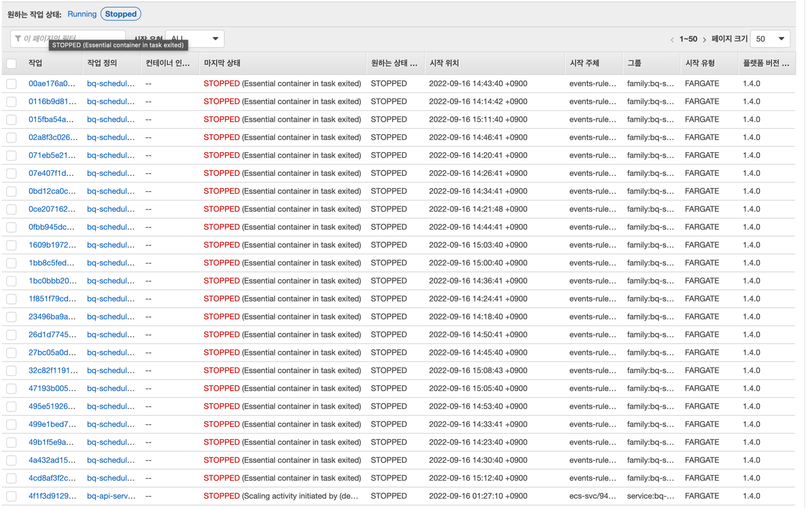

##  [Submodule] scheduled worker (with Typescript) of StayKing House

---
A command that are run to accommodate the EVMOS (EVM) side of StayKing House

## Features

---
Run the clearing bot every minute


## Getting Started


### 1. Install Dependency

```
yarn
```

### 2. Environments configuration
- Local Environment
- The following envs must be set for the local machine environment
```aidl
 export BOT_PRIVATE_KEY={Bot Execution PK}
 export STAYKING_CONTRACT_ADDRESS={StayKing Contract Address}
```

- Testnet Environment
```aidl
 Put the env variables in github secret, build image, register ECR, and distribute automatically
```

### 3. Liquidation Bot Tx Execution CLI ( Local )
```
yarn evmos:liquidation:bot --vault {Vault Contract Address}
```

### 4. Liquidation Bot Tx Execution CLI
Testnet currently runs a clearing bot every minute via AWS ECS Fargate Scheduled Job below

